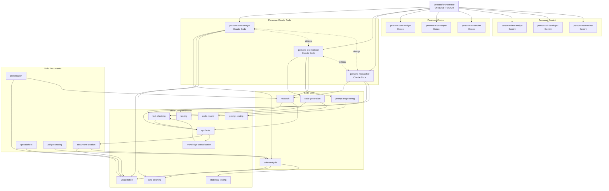
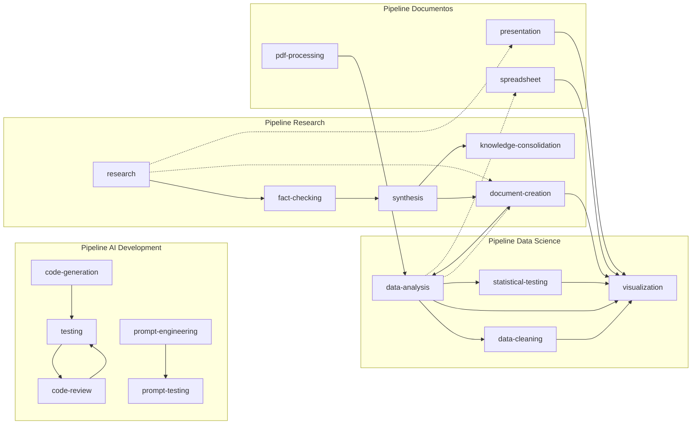

# Mapa do Grafo AI-Brain

## Visao Geral

## Grafo de Encadeamento de Skills

## Estatisticas do Grafo

| Metrica | Valor |
|---------|-------|
| Total de nos (notas) | ~50 |
| Personas | 9 (3 agentes x 3 dominios) |
| Skills Core | 4 |
| Skills Complementares | 9 |
| Skills Documento (espelho) | 4 |
| Shared rules | 2 |
| Memory nodes | 5 |
| Knowledge Base nodes | 6+ |
| Orquestrador | 1 |
| Media de conexoes por no | ~4-6 |

## Como Usar no Obsidian

1. Abrir o vault no Obsidian
2. Ir em Graph View (Ctrl+G)
3. Filtrar por tags para ver subgrafos:
   - `tag:#persona` — grafo de personas
   - `tag:#skill` — grafo de skills
   - `tag:#memory` — grafo de memoria
4. Clicar em um no para navegar para a nota
5. Usar Local Graph (na sidebar direita) para ver conexoes de uma nota especifica

## Navegacao

- Orquestrador: [[00-Meta/orchestrator]]
- MCP Schema: [[00-Meta/Schemas/mcp-server-schema]]