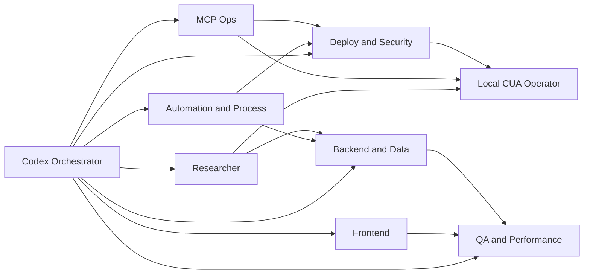
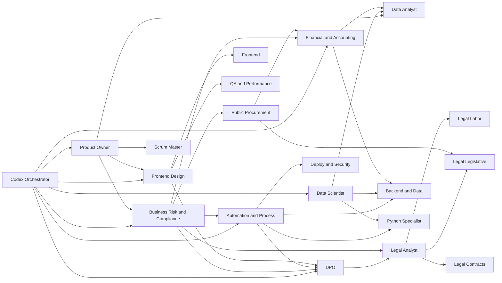

# Codex Team Graph

## Entrypoint

- Hub canonico do vault: [[00-Meta/orchestrator|Orquestrador AI-Brain]]
- Registry de rota Codex: [[00-Meta/codex-routing-registry|Codex Routing Registry]]
- Skill de entrada do runtime Codex: [[02-Skills/codex-orchestration/SKILL|Codex Orchestration]]
- Runtime local: `C:/Israel/Projetos Trae/FinManage/.codex/skills/codex-brain-orchestrator/SKILL.md`

## Grafo expandido de negocio e especialistas

## Navegacao

- [[01-Personas/codex/persona-orchestrator-finmanage|Codex Orchestrator]]
- [[01-Personas/codex/persona-researcher|Codex Researcher]]
- [[01-Personas/codex/persona-mcp-ops-specialist|Codex MCP Ops]]
- [[01-Personas/codex/persona-frontend-specialist|Codex Frontend Specialist]]
- [[01-Personas/codex/persona-backend-data-specialist|Codex Backend and Data Specialist]]
- [[01-Personas/codex/persona-qa-performance-specialist|Codex QA and Performance Specialist]]
- [[01-Personas/codex/persona-deploy-security-specialist|Codex Deploy and Security Specialist]]
- [[01-Personas/codex/persona-local-cua-operator|Codex Local CUA Operator]]
- [[01-Personas/codex/persona-product-owner|Product Owner]]
- [[01-Personas/codex/persona-scrum-master|Scrum Master]]
- [[01-Personas/codex/persona-dpo|DPO]]
- [[01-Personas/codex/persona-legal-analyst|Legal Analyst]]
- [[01-Personas/codex/persona-legal-labor-specialist|Legal Labor Specialist]]
- [[01-Personas/codex/persona-legal-legislative-specialist|Legal Legislative Specialist]]
- [[01-Personas/codex/persona-legal-contracts-specialist|Legal Contracts Specialist]]
- [[01-Personas/codex/persona-business-risk-compliance-analyst|Business Risk and Compliance Analyst]]
- [[01-Personas/codex/persona-financial-accounting-specialist|Financial and Accounting Specialist]]
- [[01-Personas/codex/persona-public-procurement-specialist|Public Procurement Specialist]]
- [[01-Personas/codex/persona-automation-process-specialist|Automation and Process Specialist]]
- [[01-Personas/codex/persona-data-scientist|Data Scientist]]
- [[01-Personas/codex/persona-python-specialist|Python Specialist]]
- [[01-Personas/codex/persona-data-analyst|Data Analyst]]
- [[01-Personas/codex/persona-frontend-design-specialist|Frontend Design Specialist]]

## Times de trabalho

- Plataforma e runtime: Orchestrator, MCP Ops, Deploy Security, Local CUA
- Product and delivery: Product Owner, Scrum Master
- Governance and legal: DPO, Legal Analyst, Legal Labor, Legal Legislative, Legal Contracts, Business Risk and Compliance
- Finance and public sector: Financial and Accounting, Public Procurement
- Automation and process: Automation and Process
- Data and intelligence: Data Scientist, Python Specialist, Data Analyst
- Experience and design: Frontend Design, Frontend Specialist, QA and Performance

## Regra do grafo

Cada nova persona deve declarar:

- qual demanda ela resolve;
- quais clusters de skill ela usa;
- para quais outras personas ela delega.
