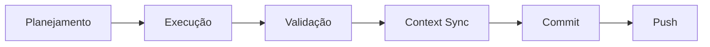

<div align="center">


# Vibe Spec Kit

### Especificações Orientadas a Documentação para Agentes de IA

[](https://opensource.org/licenses/MIT)
[](https://github.com/IsraelEvangelista/vibe-speckit)

</div>

---

## 📋 Sobre

O **Vibe Spec Kit** é um projeto de documentação orientado a especificações que guiam agentes de IA em ações específicas. Este repositório serve como um kit de ferramentas de governança para desenvolvimento assistido por IA, estruturando workflows, skills e regras de forma padronizada.

### 🎯 Objetivo

Fornecer uma base sólida de documentação que permite aos agentes de IA:
- Executar workflows específicos de forma consistente
- Compreender skills especializadas para tarefas técnicas
- Seguir regras globais que direcionam o comportamento e qualidade do código

---

## 📁 Estrutura do Projeto

```
vibe-speckit/
├── .assets/              # Assets do projeto (logos, imagens)
├── .trae/                # Regras específicas do ambiente TRAE
├── .kilocode/            # Regras específicas do Kilocode
├── .workflows/           # Workflows para guiar o agente IA
├── AGENTS.md             # Guia central de contexto dos agentes
├── CLAUDE.md             # Documentação específica para Claude
└── user_rules.md         # Regras globais do usuário
```

---

## 🧩 Componentes Principais

### 1. Workflows

Os **Workflows** são fluxos estruturados que guiam o agente de IA em ações específicas, garantindo consistência e qualidade na execução de tarefas.

| Workflow | Descrição |
|----------|-----------|
| `context_sync.md` | Garante que a documentação reflete a realidade do código após conclusão de epics/tasks |
| `debug.md` | Roteiro para identificação, análise e correção de erros (Lint, TypeScript, Build) |
| `migration_supabase.md` | Guias para migração e integração com Supabase |
| `real_time_chat.md` | Implementação de funcionalidades de chat em tempo real |
| `security.md` | Verificação de segurança de segredos, variáveis de ambiente e exposição de dados |
| `ui_component.md` | Padrão para criação de novos componentes visuais mantendo consistência |

### 2. Skills

As **Skills** são documentações em markdown que trazem habilidades necessárias aos agentes executarem trabalhos específicos.

> ⚠️ **Em Construção**: Esta seção está sendo enriquecida. Planejamos baixar skills por categoria do [SkillsMP](https://skillsmp.com/).

### 3. Rules

As **Rules** compõem a documentação global do usuário que direciona o agente em como proceder com a documentação dentro de qualquer projeto.

#### Arquivos de Regras

| Arquivo | Descrição |
|---------|-----------|
| `user_rules.md` | Regras globais de usuário (TRAE SOLO) |
| `.trae/rules/project_rules.md` | Regras específicas do ambiente TRAE |
| `.kilocode/rules/byterover-rules.md` | Regras do Byterover MCP |

#### Princípios Principais

- **Segurança**: Proteção de credenciais, uso de variáveis de ambiente, RLS em bancos de dados
- **Qualidade**: Linting, TypeScript, testes, build, acessibilidade
- **Governança**: Gestão em `.trae/`, EPICS.md, PRD.md, BUG.md
- **Pesquisa**: Priorização de documentação oficial e evidências técnicas
- **MCPs**: Uso adequado de Model Context Protocol para diferentes situações

---

## 🚀 Como Usar

### Para Desenvolvedores

1. **Clone o repositório**:
   ```bash
   git clone https://github.com/IsraelEvangelista/vibe-speckit.git
   cd vibe-speckit
   ```

2. **Leia a documentação**:
   - Comece por `AGENTS.md` para entender o contexto dos agentes
   - Revise `user_rules.md` para compreender as regras globais
   - Explore os workflows em `.workflows/` conforme sua necessidade

3. **Integre com seu projeto**:
   - Copie a estrutura de `.trae/` e `.workflows/` para seu projeto
   - Adapte as regras conforme necessário
   - Configure seu agente IA para seguir os workflows

### Para Agentes de IA

Ao iniciar uma nova sessão de trabalho:

1. **Leia `AGENTS.md`** para obter contexto atual
2. **Consulte os workflows relevantes** para sua tarefa
3. **Siga as regras em `user_rules.md`** para garantir qualidade e segurança
4. **Use os MCPs apropriados** para buscar informações externas, debug, etc.

---

## 🔧 Fluxo de Trabalho

### Ciclo de Desenvolvimento



### Workflows por Situação

| Situação | Workflow | MCPs Recomendados |
|----------|----------|-------------------|
| Busca de informações na web | N/A | `perplexity`, `firecrawl` |
| Debug da aplicação rodando | `debug.md` | `chrome-devtools`, `playwright`, `testsprite` |
| Documentação de stacks | N/A | `n8n-mcp`, `context7` |
| Início/Fim de implementação | `context_sync.md` | `byterover` |
| Verificação de segurança | `security.md` | N/A |

---

## 📚 Documentação de Referência

- **SkillsMP**: Marketplace de skills para agentes de IA - [https://skillsmp.com/](https://skillsmp.com/)
- **Claude Skills**: Documentação oficial de skills do Claude
- **OpenAI Codex**: Documentação do Codex CLI e ChatGPT

---

## 🛠️ Stack de Ferramentas

Este projeto utiliza:

- **Git**: Controle de versão
- **Markdown**: Formato de documentação
- **MCP (Model Context Protocol)**: Integração com ferramentas externas
  - `Byterover`: Contexto e instruções
  - `Perplexity`: Busca na web
  - `Firecrawl`: Web scraping
  - `Chrome DevTools`: Debug
  - `Playwright`: Testes E2E
  - `TestSprite`: Testes automatizados
  - `n8n-mcp`: Automações
  - `Context7`: Documentação de bibliotecas

---

## 🤝 Contribuindo

Este projeto está em constante evolução. Contribuições são bem-vindas nos seguintes formatos:

1. **Novos Workflows**: Crie workflows para situações não cobertas
2. **Skills**: Documente skills especializadas (baseadas no padrão SKILL.md)
3. **Melhorias nas Regras**: Sugira aprimoramentos nas regras existentes
4. **Correções**: Reporte bugs ou problemas na documentação

### Processo de Contribuição

1. Fork o repositório
2. Crie uma branch para sua feature (`git checkout -b feature/nova-feature`)
3. Commit suas mudanças (`git commit -m 'feat: adicionar novo workflow'`)
4. Push para a branch (`git push origin feature/nova-feature`)
5. Abra um Pull Request

---

## 📝 Padrão de Commits

Este projeto segue o padrão de commits semânticos:

```
type(scope): resumo curto
```

- **feat**: Nova funcionalidade
- **fix**: Correção de bug
- **docs**: Mudanças na documentação
- **style**: Mudanças de formatação (sem impacto no código)
- **refactor**: Refatoração de código
- **test**: Adição ou modificação de testes
- **chore**: Mudanças em processos ou ferramentas de build

---

## 📄 Licença

Este projeto está sob a licença MIT. Veja o arquivo [LICENSE](LICENSE) para mais detalhes.

---

## 👤 Autor

**Israel Evangelista**

- GitHub: [@IsraelEvangelista](https://github.com/IsraelEvangelista)

---

<div align="center">

**⭐ Se este projeto foi útil para você, considere dar uma estrela!**

</div>
